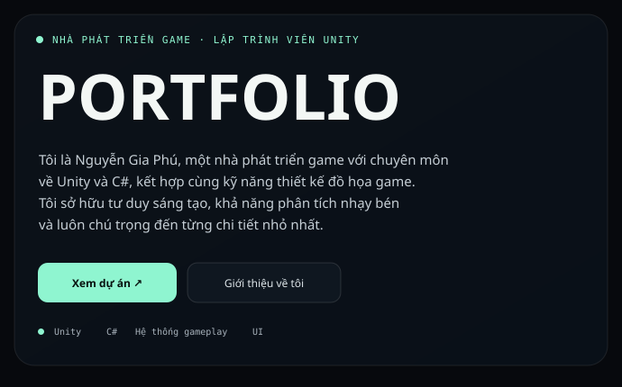
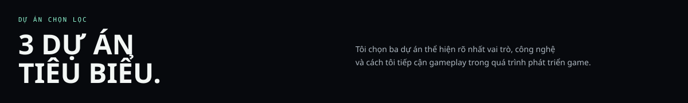
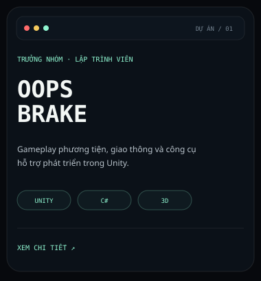
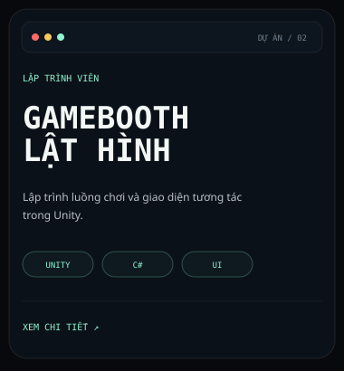
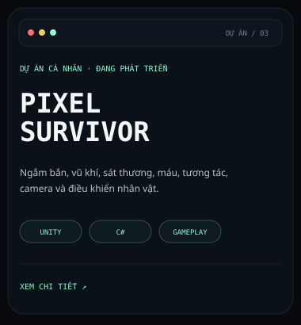
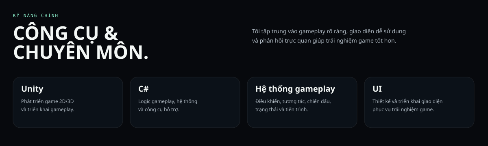
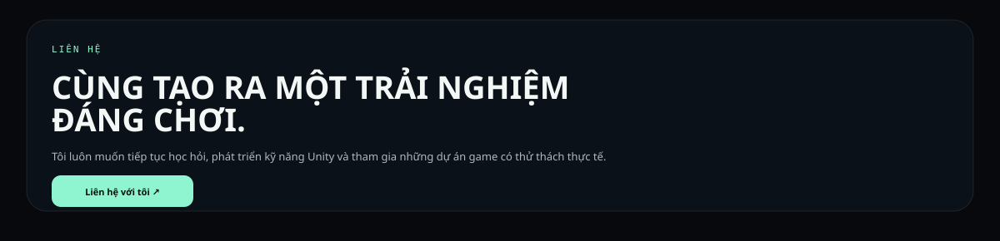

<table>
<tr>
<td width="58%" valign="top">

</td>
<td width="42%" valign="top" align="center">

</td>
</tr>
</table>

 

<table>
<tr>
<td width="33.33%" valign="top">

</td>
<td width="33.33%" valign="top">

</td>
<td width="33.33%" valign="top">

</td>
</tr>
</table>

 

 

 

