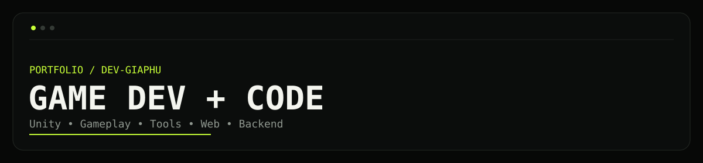
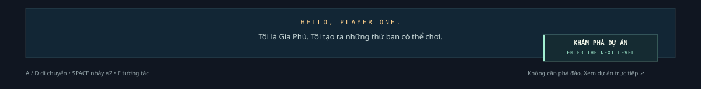
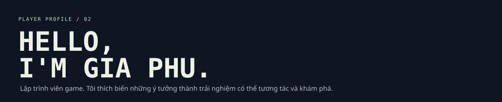
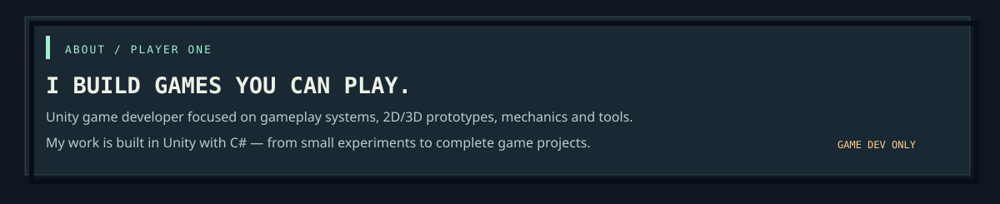
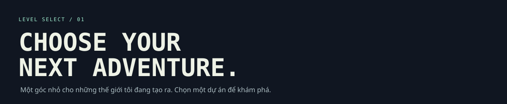
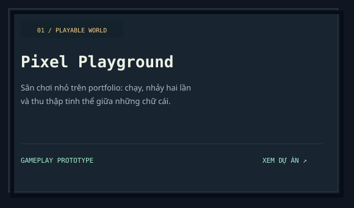
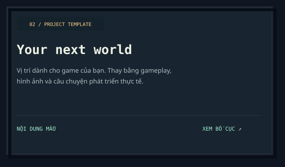
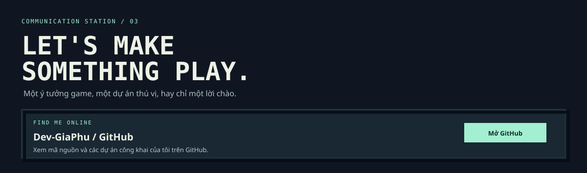
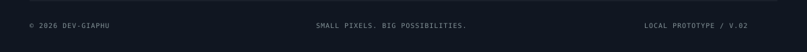

 

<table>
<tr>
<td width="46%" valign="top" align="center">

</td>
<td width="54%" valign="top">

</td>
</tr>
</table>

 

<table>
<tr>
<td width="50%" valign="top">

</td>
<td width="50%" valign="top">

</td>
</tr>
</table>

 

 

